# 💎 Prismetrics: Option Analysis & Visualization

**Explore options pricing  • Visualize market behavior**

## Overview  
Prismetrics is an interactive dashboard that lets you explore option prices, Greeks, and implied volatility patterns. 
It’s a hands-on tool for understanding how market data and model assumptions affect option valuation.

## Objectives
- Load real market data for stocks and their option chains  
- Calculate theoretical prices using the Black-Scholes model  
- Compute key Greeks (Delta, Gamma, Theta, Vega, Rho)  
- Visualize pricing heatmaps, P&L scenarios, IV surfaces, and volatility smiles  

## Key Features
1. **Company Fundamentals** – View market cap, P/E, dividend yield, sector/industry info  
2. **Pricing & Greeks** – Calculate option price and Greeks with one click  
3. **Heatmaps** – See option prices and profit/loss across strikes & expiries  
4. **Volatility Analysis** – Plot IV surface and compare model vs. market smiles  
5. **Interactive Controls** – Adjust spot, strike, rate, volatility source, and expiry  

## How It Works
1. **Select Stock** – Pick from a list of tickers loaded from live data  
2. **Choose Expiry & Strike** – Set your option contract parameters  
3. **Set Rate & Volatility** – Use historical or implied volatility and risk-free rate  
4. **View Tabs** –  
   - **Company Info**: Fundamentals & market metrics  
   - **Pricing & Greeks**: Black-Scholes output & risk measures  
   - **Analysis**: Heatmaps, smiles, and surfaces  
5. **Interpret Visuals** – Use charts to understand sensitivities and scenarios  

## Tech Stack
- **Python 3.8+**  
- **Streamlit** (dashboard UI)  
- **Matplotlib** & **Seaborn** (plots)  
- **NumPy** & **Pandas** (data handling)  
- **Custom data modules** for market, IV surface, and smile values  

## Quick Start
```bash
git clone https://github.com/Manthan-D-Parmar/Prismetrics.git
cd Prismetrics
pip install -r requirements.txt
streamlit run app.py
````

## Demo Screenshots

Here are some screenshots showcasing Prismetrics in action:


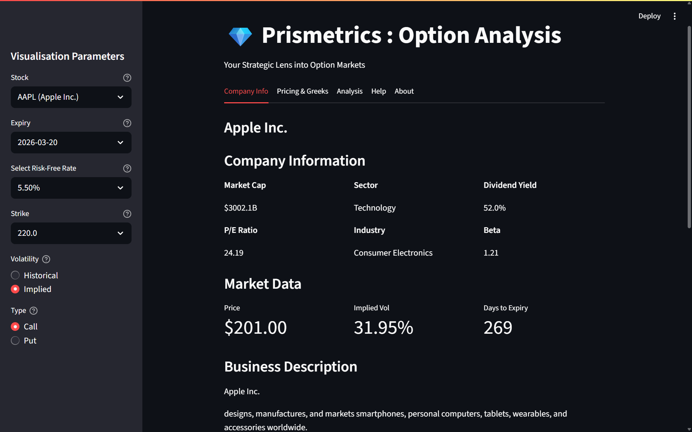

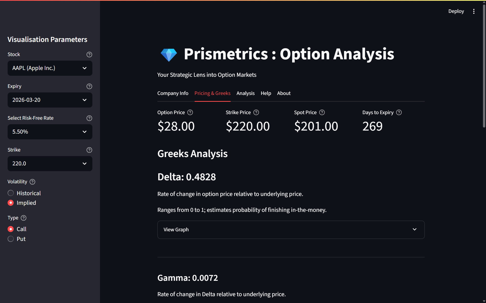  

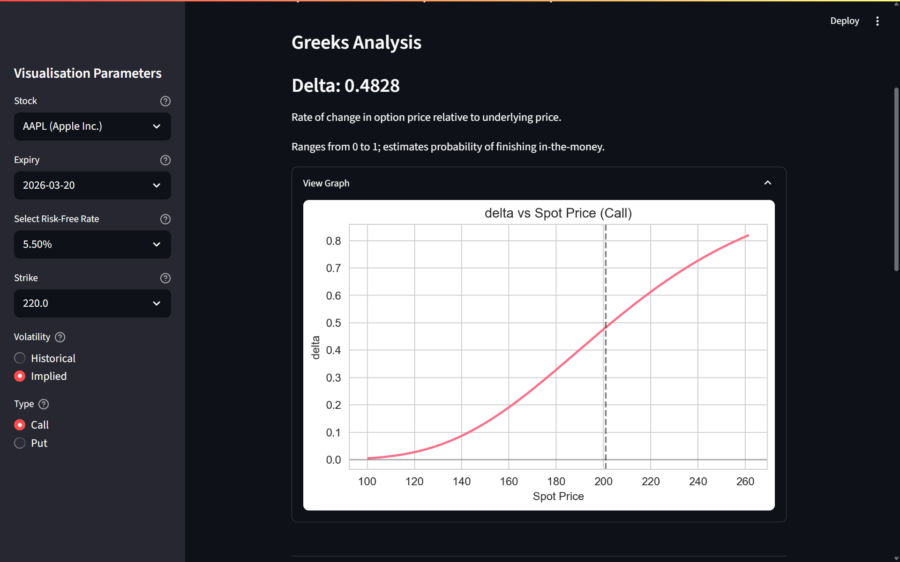  

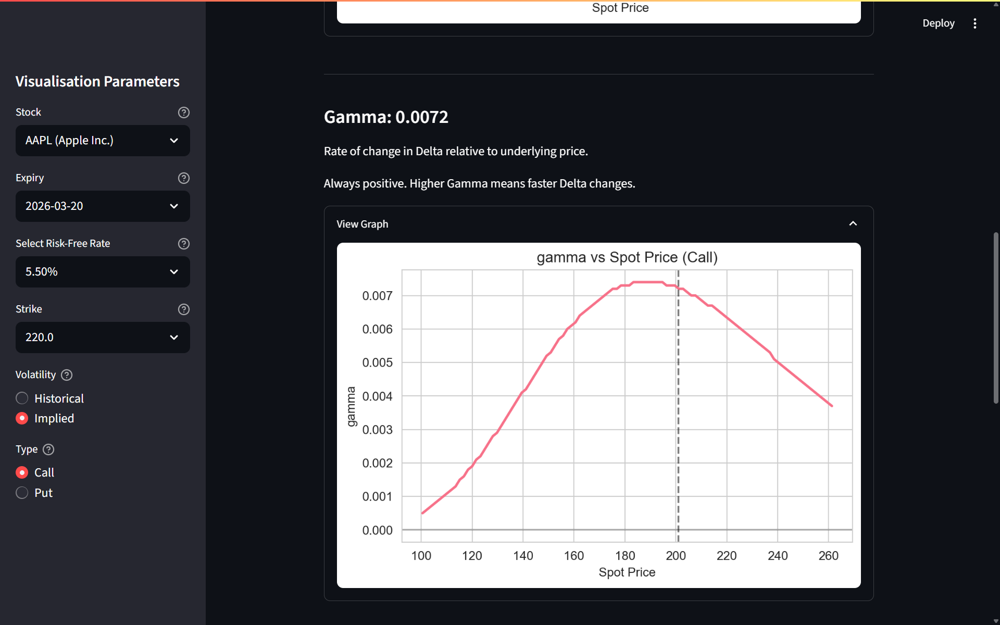

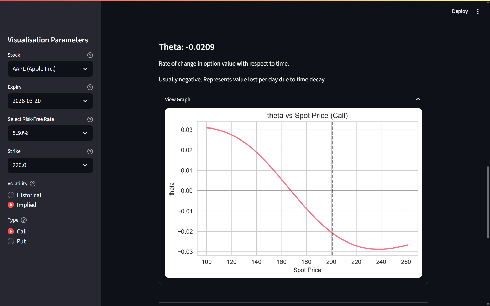  

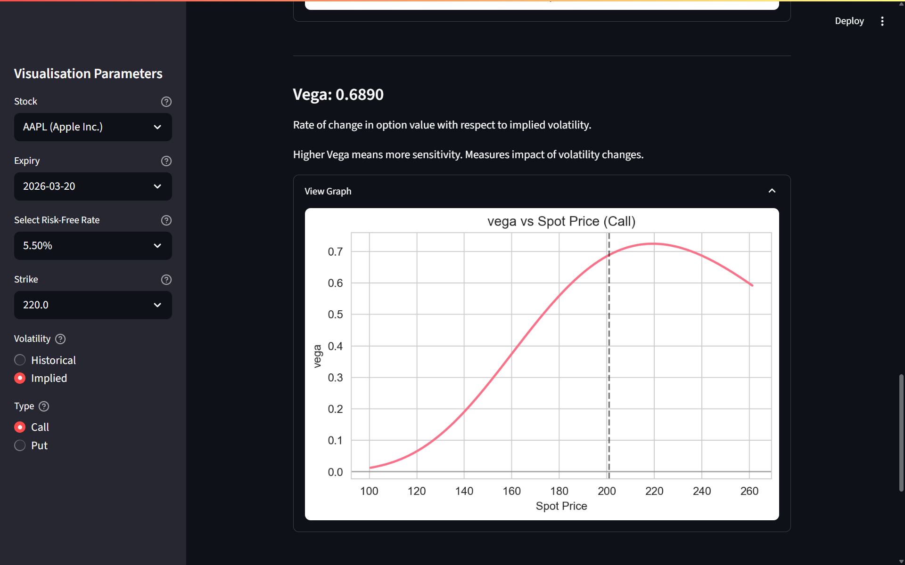  

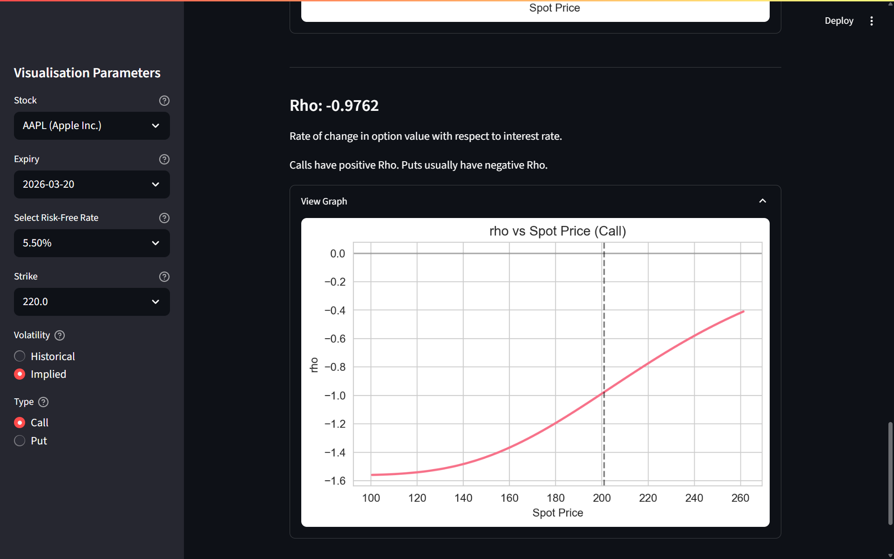

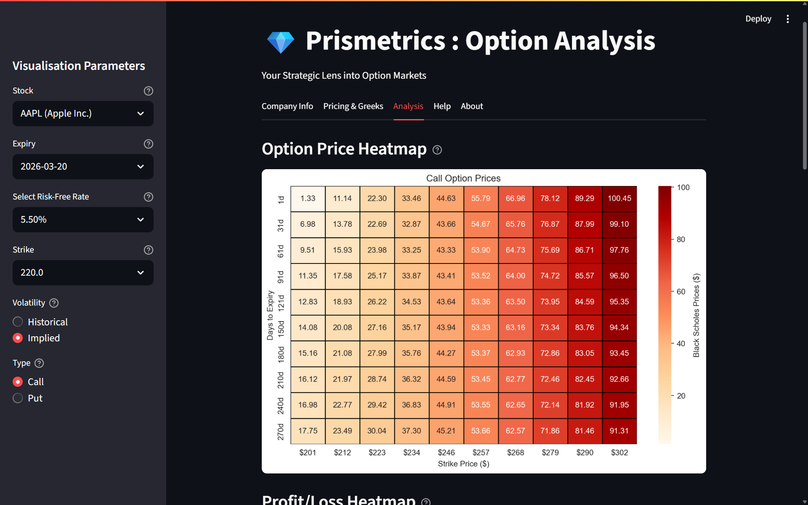  

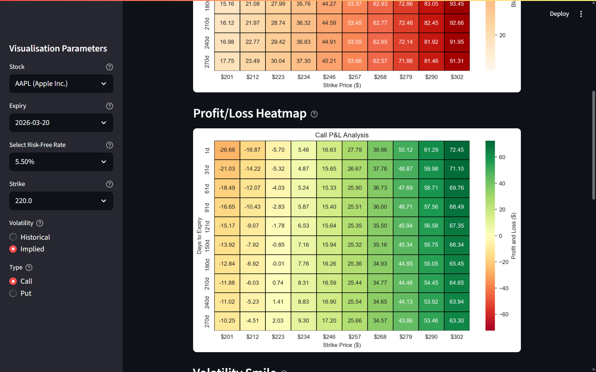 

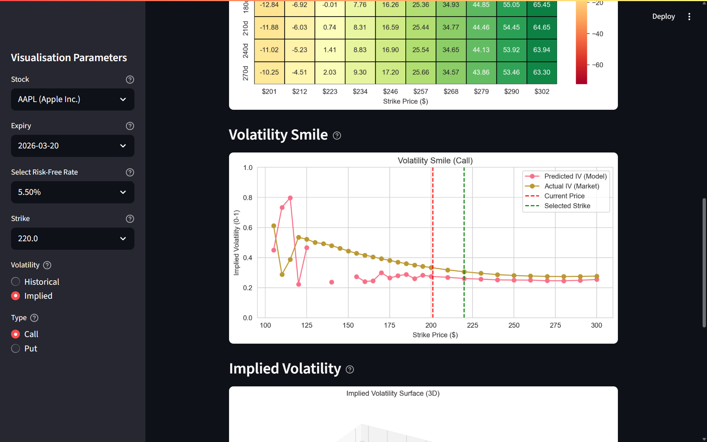

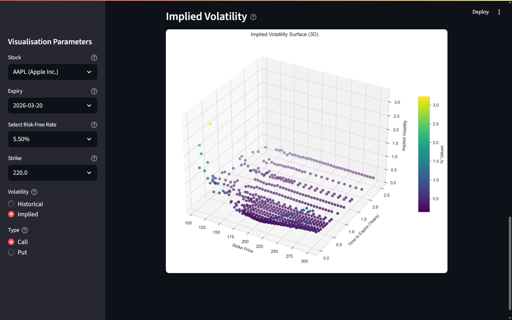  


*Developed by Manthan Parmar • MIT License • Data from live market feeds*

```
```
